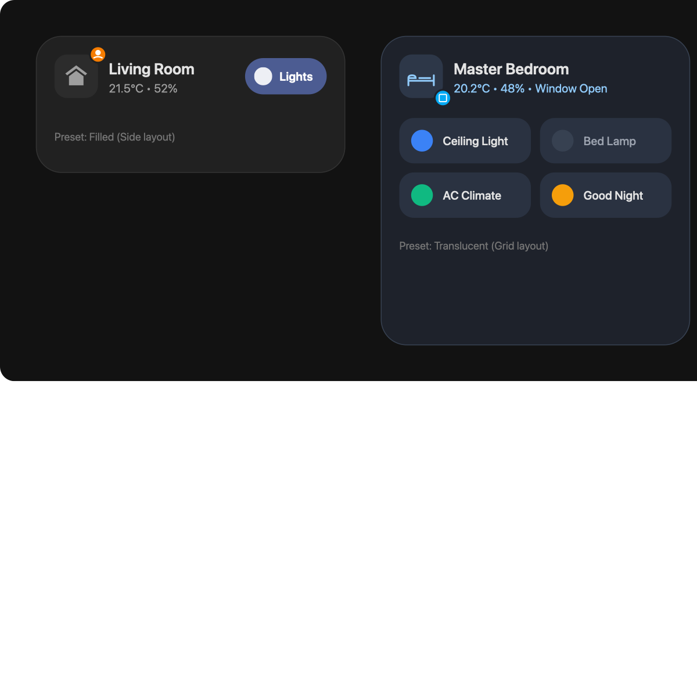

# Material Room Card

[](https://github.com/hacs/default)
[](https://github.com/ChrissHF/Modern-Room-Card/releases)
[](https://opensource.org/licenses/MIT)

An elegant, high-performance, and deeply customizable Room Card for Home Assistant following Google's **Material You (Material Design 3)** design philosophy.

Seamlessly integrates with Material You themes, supports native and custom Card Features (such as [custom-card-features](https://github.com/Nerwyn/custom-card-features)), and is fully configurable via the Home Assistant visual GUI card editor.



---

*Read this in other languages: [English](#english), [Deutsch](#deutsch).*

---

<a name="english"></a>
## English

### Key Features

* **Material You Design**: Uses official Material Design 3 tokens (`--md-sys-color-*`) with graceful fallbacks for dynamic color palettes and system themes.
* **Automatic Area & Entity Resolution**: Simply configure `area` or `area_id`. The card automatically discovers:
  * Room title and area icon
  * Temperature and humidity sensors
  * Window/door opening sensors
  * Main room lights or switches for presence indication
* **Flexible Feature Layouts**: Place native or custom control buttons where they fit best:
  * **Side**: Horizontally aligned on the right side of the header.
  * **Bottom**: Vertically stacked beneath the header.
  * **Grid**: Multi-column grid layout with configurable columns (`1` to `4`).
* **Built-in Style Presets**: Switch styles directly via `style_type` in YAML/GUI or via standard card-mod classes.
* **Rich Interactions**: Full support for tap, hold, and double-tap actions.
* **Visual Card Editor**: Complete GUI editor for room selection, sensor overrides, style presets, and feature management.
* **Optimized Performance**: Fine-grained `shouldUpdate` lifecycle tracking and stable context memoization prevent re-render thrashing and ensure custom card features never lag or freeze.

---

### Installation

#### 1. Via HACS (Recommended)

1. Open **HACS** in your Home Assistant dashboard.
2. Click the top-right menu (three dots) and select **Custom repositories**.
3. Add the URL of this repository: `https://github.com/ChrissHF/Modern-Room-Card`
4. Set the category to **Lovelace (Dashboard)** and click **Add**.
5. Search for **Material Room Card** and click **Download**.
6. Refresh your browser dashboard.

#### 2. Manual Installation

1. Download `material-room-card.js` from the [latest release](https://github.com/ChrissHF/Modern-Room-Card/releases) (or from the `dist/` folder after building).
2. Copy `material-room-card.js` into your Home Assistant `/config/www/` directory.
3. In Home Assistant, navigate to **Settings → Dashboards → Resources**.
4. Add a new resource:
   * **URL**: `/local/material-room-card.js`
   * **Type**: `JavaScript Module`
5. Refresh your browser.

---

### Style Presets

The card supports switching styles either via the `style_type` configuration option or via card-mod classes:

```yaml
style_type: translucent
```
or
```yaml
card_mod:
  class: translucent
```

| Preset | Description |
|--------|-------------|
| `filled` | Classic Material You surface container (default) |
| `elevated` | Container with soft elevation drop shadow |
| `transparent` | Transparent background without border |
| `outlined` | Transparent background with subtle outline border |
| `translucent` | Frosted glassmorphism effect (backdrop-filter: blur(12px)) |

---

### Configuration Options

| Option | Type | Default | Description |
|--------|------|---------|-------------|
| `type` | string | **Required** | Must be `custom:material-room-card`. |
| `area` | string | — | Area name or ID for auto entity discovery (e.g. `Bedroom` or `bedroom`). |
| `area_id` | string | — | Area ID for auto entity discovery. |
| `title` | string | — | Custom title override for the room. |
| `icon` | string | — | Custom icon override for the room. |
| `style_type` | string | `filled` | Style preset (`filled`, `elevated`, `transparent`, `outlined`, `translucent`). |
| `feature_layout` | string | `side` | Layout positioning for features (`side`, `bottom`, `grid`). |
| `feature_grid_columns` | number | `2` | Column count when `feature_layout` is set to `grid`. |
| `temperature_entity` | string | — | Sensor entity ID for temperature (auto-discovered if omitted). |
| `humidity_entity` | string | — | Sensor entity ID for humidity (auto-discovered if omitted). |
| `window_entity` | string | — | Binary sensor entity ID for window status (auto-discovered if omitted). |
| `entity` | string | — | Primary entity for the active presence badge (auto-discovered if omitted). |
| `secondary_text_source` | string | `combined` | Data source for subtitle (`combined`, `temperature`, `humidity`, `custom`, `hidden`). |
| `secondary_text_template` | string | — | Custom template string when using `custom` (use `{temperature}` and `{humidity}` placeholders). |
| `show_icon` | boolean | `true` | Show or hide the main room icon. |
| `show_secondary_text` | boolean | `true` | Show or hide the secondary subtitle. |
| `features` | list | `[]` | List of card features (e.g. native tile features or custom card features). |
| `tap_action` | object | `{ action: more-info }` | Action on tap. |
| `hold_action` | object | — | Action on long press. |
| `double_tap_action` | object | — | Action on double tap. |

---

### YAML Examples

#### 1. Minimal Auto-Configured Room Card
Discovers room name, icon, sensors, and lights for the living room automatically:

```yaml
type: custom:material-room-card
area: living_room
```

#### 2. Advanced Room Card with Grid Features
```yaml
type: custom:material-room-card
area_id: bedroom
title: Master Bedroom
icon: mdi:bed-king
style_type: translucent
feature_layout: grid
feature_grid_columns: 2
features:
  - type: custom:button-feature
    entity: light.bedroom_ceiling
    icon: mdi:ceiling-light
  - type: custom:button-feature
    entity: light.bedside_lamp
    icon: mdi:lamp
  - type: custom:button-feature
    entity: switch.bedroom_fan
    icon: mdi:fan
  - type: custom:button-feature
    entity: scene.good_night
    icon: mdi:weather-night
tap_action:
  action: navigate
  navigation_path: /dashboard/bedroom
```

---

<a name="deutsch"></a>
## Deutsch

### Hauptmerkmale

* **Material You Design**: Nutzt standardmäßige MD3-Farbvariablen (`--md-sys-color-*`) mit eleganten Fallbacks für maximale Kompatibilität mit dynamischen Farbpaletten.
* **Automatische Raumauflösung**: Gib einfach `area` oder `area_id` an. Die Karte ermittelt automatisch:
  * Den Namen des Raums
  * Das Raum-Icon
  * Sensoren für Temperatur und Luftfeuchtigkeit im Raum
  * Haupt-Steuerelemente (Licht/Schalter) im Raum für die Präsenzanzeige
* **Flexible Feature-Layouts**: Platziere Funktions-Buttons an verschiedenen Positionen:
  * **Side**: Horizontal auf der rechten Seite des Headers.
  * **Bottom**: Vertikal gestapelt unter dem Header.
  * **Grid**: In einem konfigurierbaren Spalten-Raster (1 bis 4 Spalten).
* **Card-Mod & Style Presets**: Integrierte Unterstützung für standardmäßige Card-Mod-Klassen sowie direkte Konfiguration über das YAML-Feld `style_type`.
* **Interaktionen**: Volle Unterstützung für Tippen, Gedrückthalten und Doppeltippen-Aktionen.
* **GUI-Editor**: Vollständiger visueller Editor zum Verwalten von Raum-Einstellungen, Layouts und Features.

---

### Installation

#### 1. Über HACS (Empfohlen)

1. Öffne **HACS** in Home Assistant.
2. Klicke oben rechts auf die drei Punkte und wähle **Benutzerdefinierte Repositories**.
3. Füge die URL dieses Repositories hinzu: `https://github.com/ChrissHF/Modern-Room-Card`
4. Wähle **Lovelace** als Kategorie und klicke auf **Hinzufügen**.
5. Suche nach **Material Room Card** und installiere sie.

#### 2. Manuelle Installation

1. Lade die Datei `material-room-card.js` aus dem letzten Release (oder dem Ordner `dist/`) herunter.
2. Kopiere die Datei in deinen Home Assistant `/config/www/` Ordner.
3. Gehe zu **Einstellungen → Dashboards → Ressourcen** und füge hinzu:
   * **URL**: `/local/material-room-card.js`
   * **Typ**: `JavaScript-Modul`

---

## License

This project is licensed under the MIT License - see the [LICENSE](LICENSE) file for details.
